# Revisiting Trade-offs between Rubisco Kinetic Parameters

[](https://www.biorxiv.org/content/early/2018/11/14/470021)
[](https://pubs.acs.org/doi/10.1021/acs.biochem.9b00237)
[](#requirements--environment)

This repository contains data, analytical workflows, statistical models, and Jupyter notebooks accompanying the publication:

> **Avi I. Flamholz, Noam Prywes, Uri Moran, Dan Davidi, Yinon M. Bar-On, Luke M. Oltrogge, Ron Milo, and David F. Savage.**  
> *"Revisiting Trade-offs between Rubisco Kinetic Parameters"*  
> **Biochemistry 2019**, 58 (33), 3365–3376. DOI: [10.1021/acs.biochem.9b00237](https://doi.org/10.1021/acs.biochem.9b00237).  
> *(Preprint available on [bioRxiv](https://www.biorxiv.org/content/early/2018/11/14/470021)).*

---

## Table of Contents
1. [Scientific Overview](#scientific-overview)
2. [Repository Structure](#repository-structure)
3. [Kinetic Parameters & Modeling Methodology](#kinetic-parameters--modeling-methodology)
4. [Data Analysis & Figure Descriptions](#data-analysis--figure-descriptions)
   - [Main Text Figures (Figures 2–8)](#main-text-figures)
   - [Supplementary Figures (Figures S3–S11)](#supplementary-figures)
   - [Data Cleaning & Validation Notebooks](#data-cleaning--validation-notebooks)
5. [Datasets Overview](#datasets-overview)
6. [Core Code Modules](#core-code-modules)
7. [Requirements & Setup](#requirements--setup)
8. [Citation](#citation)

---

## Scientific Overview

**Ribulose-1,5-bisphosphate carboxylase/oxygenase (Rubisco)** is the primary carboxylase of the Calvin-Benson-Bassham (CBB) cycle, responsible for the vast majority of organic carbon fixation on Earth. Despite its centrality to the biosphere and global crop yield, Rubisco is notoriously slow ($k_{\text{cat},C} \approx 1\text{--}10\text{ s}^{-1}$) and promiscuous, catalyzing an energy-wasting oxygenation reaction that triggers photorespiration.

For over a decade, the predominant dogma in Rubisco biochemistry—anchored by influential studies such as *Tcherkez et al. (2006)* and *Savir et al. (2010)*—held that:
1. **Rubisco is constrained to a 1D Pareto-optimal frontier:** Carboxylation rate ($k_{\text{cat},C}$) and specificity ($S_{C/O}$) were posited to have a strict, inverse trade-off, meaning Rubisco cannot be improved in speed without sacrificing specificity.
2. **Carboxylation rate and substrate affinity trade off:** High turnover rates ($k_{\text{cat},C}$) were thought to strictly require low affinity for $\text{CO}_2$ (high $K_C$).
3. **Rubisco is "nearly perfectly optimized"**: Natural evolutionary variation was thought to occupy a tightly constrained line, discouraging synthetic efforts to engineer a faster, more specific enzyme.

### Key Discoveries from this Expanded Analysis
Prior conclusions were based on kinetic datasets from only **$\approx 20$ organisms**, predominantly terrestrial C3 and C4 crop plants. By compiling an extended dataset of **over 300 Rubisco variants from $>200$ unique organisms** across diverse lineages (including ferns, diatoms, red and brown algae, cyanobacteria, and anaerobic bacteria):

- **Trade-offs are substantially attenuated:** The classical inverse relationship between carboxylation rate ($k_{\text{cat},C}$) and specificity ($S_{C/O}$) is much weaker than previously claimed ($R \approx -0.56$ for Form I enzymes, and virtually zero across all forms, down from $R \approx -0.71$ to $-0.90$ in earlier subsets). Similarly, the $k_{\text{cat},C}\text{--}K_C$ correlation drops from $R \approx 0.92$ to $R \approx 0.48$.
- **Mechanistic Proposal #1 is unsupported:** The hypothesis that carboxylation catalytic efficiency ($k_{\text{cat},C}/K_C$) is coupled directly to carboxylation turnover rate ($k_{\text{cat},C}$) shows no statistically significant correlation ($R = 0.12, P = 0.054$).
- **Mechanistic Proposal #2 is strongly supported:** Carboxylation catalytic efficiency ($k_{\text{cat},C}/K_C$) and oxygenation catalytic efficiency ($k_{\text{cat},O}/K_O$) exhibit an exceptionally tight power-law coupling ($R = 0.94, P = 6 \times 10^{-87}$), with an exponent indistinguishable from 1.0 ($b = 1.04$, 95% CI: 0.93–1.12).
- **Physical Chemistry of $\text{CO}_2/\text{O}_2$ Discrimination:** The dominant evolutionary constraint on Rubisco is not a rigid trade-off between speed and specificity, but rather the fundamental chemical difficulty of discriminating between two non-polar, linear diatomic/triatomic gases ($\text{CO}_2$ and $\text{O}_2$) at the transition state. This suggests Rubisco is not stuck on a 1D line and that bioengineering may have more latitude than previously assumed.

---

## Repository Structure

```
rubisco/
├── data/
│   ├── DatasetS1_RubiscoKinetics.xlsx          # Raw literature data compilation from 61 studies
│   ├── DatasetS1_SourceRubiscoKinetics.csv       # Machine-readable source dataset
│   ├── DatasetS2_RubiscoKinetics_Merged.csv      # Standardized, cleaned dataset with inferred kinetics
│   ├── DatasetS3_BRENDA_Kinetics.csv             # Enzyme kinetics from BRENDA (variability benchmarking)
│   ├── DatasetS4_RubiscoKineticsFull_Merged.csv  # Extended dataset including mutant & annotated variants
│   └── AF_KIE_analysis.xlsx                      # Kinetic isotope effect (KIE) calculations & data
├── notebooks/
│   ├── power_laws.py                             # Total Least Squares (TLS) / ODR regression routines
│   ├── rubisco_data.py                           # Data loading, filtering, and merging helpers
│   ├── stats_utils.py                            # Parametric bootstrapping and statistical utilities
│   ├── Normalize and Merge Raw Data.ipynb        # Data cleaning, error propagation, and inference pipeline
│   ├── Dataset Sanity Checks.ipynb               # Quality checks for duplicates and reference consensus
│   ├── Bootstrapping Sanity Checks.ipynb         # Validation of bootstrap-inferred kinetic parameters
│   ├── Figure2 Models of Constraint.ipynb        # Theoretical Pareto frontier models (Figure 2)
│   ├── Figure3 Dataset Summary.ipynb             # Dataset breadth, taxonomy, parameter distributions (Figure 3)
│   ├── Figure4 Correlation Heatmap.ipynb         # Pairwise kinetic parameter correlations (Figure 4)
│   ├── Figure5 Previous kcatC Correlations.ipynb # Tests of classic kcat,C trade-offs (Figure 5)
│   ├── Figure6 Mechanistic Proposal #1.ipynb     # Test of kcat,C vs kcat,C/KC coupling (Figure 6)
│   ├── Figure7 Mechanistic Proposal #2.ipynb     # Power-law coupling of catalytic efficiencies (Figure 7)
│   ├── Figure8 Reactive State Model.ipynb        # Specificity clustering and Reactive State Model (Figure 8)
│   ├── FigureS3 Error Analysis.ipynb             # Experimental measurement error scaling (Figure S3)
│   ├── FigureS4 Kinetic Parameter Histograms.ipynb # Parameter histograms across Rubisco forms (Figure S4)
│   ├── Figure S5 kcat variability.ipynb          # Rubisco vs BRENDA enzyme kcat variability (Figure S5)
│   ├── FigureS6 Rubisco Kinetics by Host Type.ipynb # Kinetics grouped by host physiological type (Figure S6)
│   ├── FigureS7 linear correlations.ipynb        # Linear vs log-scale correlation comparisons (Figure S7)
│   ├── Figure S8 PCA.ipynb                       # Principal Component Analysis of kinetic space (Figure S8)
│   ├── FigureS9 Residual Analysis.ipynb          # Residual analysis of power-law regressions (Figure S9)
│   ├── FigureS10 kcatO correlations.ipynb        # Correlations involving oxygenation rate kcat,O (Figure S10)
│   └── FigureS11 Mutant Kinetics.ipynb           # Engineered mutant kinetics vs wild-type (Figure S11)
├── README.md
└── .gitignore
```

---

## Kinetic Parameters & Modeling Methodology

### Core Kinetic Parameters

| Symbol | Parameter | Standard Units | Description |
|:---|:---|:---:|:---|
| $k_{\text{cat},C}$ (or $v_C$) | Carboxylation Turnover Rate | $\text{s}^{-1}$ | Maximum rate of $\text{CO}_2$ fixation per active site |
| $K_C$ | Michaelis Constant for $\text{CO}_2$ | $\mu\text{M}$ | Effective half-saturation concentration for $\text{CO}_2$ |
| $k_{\text{cat},O}$ (or $v_O$) | Oxygenation Turnover Rate | $\text{s}^{-1}$ | Maximum rate of $\text{O}_2$ fixation per active site |
| $K_O$ | Michaelis Constant for $\text{O}_2$ | $\mu\text{M}$ | Effective half-saturation concentration for $\text{O}_2$ |
| $S_{C/O}$ (or $S$) | Carboxylation Specificity Factor | unitless | Relative catalytic preference for $\text{CO}_2$ over $\text{O}_2$ |
| $k_{\text{cat},C} / K_C$ ($k_{\text{on},C}$) | Carboxylation Catalytic Efficiency | $\mu\text{M}^{-1}\text{s}^{-1}$ | Second-order rate constant for carboxylation |
| $k_{\text{cat},O} / K_O$ ($k_{\text{on},O}$) | Oxygenation Catalytic Efficiency | $\mu\text{M}^{-1}\text{s}^{-1}$ | Second-order rate constant for oxygenation |

Specificity is mechanistically defined by the ratio of second-order catalytic efficiencies:
$$S_{C/O} = \frac{k_{\text{cat},C} / K_C}{k_{\text{cat},O} / K_O} = \frac{v_C \cdot K_O}{v_O \cdot K_C}$$

Because $k_{\text{cat},O}$ ($v_O$) is notoriously difficult to measure directly (due to simultaneous carboxylation and oxygenation in standard assays), it is uniformly inferred with error propagation using:
$$v_O = \frac{K_O \cdot v_C}{S_{C/O} \cdot K_C}, \quad k_{\text{on},O} = \frac{v_C}{S_{C/O} \cdot K_C}$$

### Statistical Modeling Framework

1. **Multiplicative Error Model:**  
   Measurement errors scale proportionally with parameter values across all directly measured variables (constant coefficient of variation). This necessitates analyzing relationships in **logarithmic space** ($\ln x$ or $\log_{10} x$).
2. **Multiplicative Standard Deviation ($\sigma^*$):**  
   To quantify variability on a log-scale:
   $$\sigma^* = \exp\left(\text{std}(\ln x)\right)$$
   A parameter with $\sigma^* = 1.3$ varies by a factor of 1.3 around its geometric mean.
3. **Orthogonal Distance Regression (ODR) / Total Least Squares (TLS):**  
   Standard Ordinary Least Squares (OLS) regression erroneously assumes that the independent variable ($X$) is error-free. Because both $X$ and $Y$ are empirical biological measurements subject to experimental uncertainty, all power laws ($y = a x^b$) are fitted using **Total Least Squares (ODR)** via `scipy.odr`, minimizing orthogonal Euclidean distance to the fit line in log-log space.
4. **Subsampling Bootstrapping:**  
   Confidence intervals for power-law exponents ($b$), prefactors ($a$), and Pearson correlation coefficients ($R$) are generated through 1,000 rounds of 90% subsampling bootstrapping (`power_laws.bootstrap_power_law_odr`).

---

## Data Analysis & Figure Descriptions

Below is a detailed walkthrough of the analytical steps, hypotheses, and conclusions associated with each figure in the repository.

### Main Text Figures

#### [Figure 2: Models of Catalytic Constraint](notebooks/Figure2%20Models%20of%20Constraint.ipynb)
- **Scientific Context:** Explores theoretical evolutionary landscapes for multi-objective enzyme optimization.
- **Panel A (1D Pareto Frontier):** Depicts the classical view where enzymes are tightly constrained to a 1D trade-off line. Any mutation increasing $k_{\text{cat},C}$ strictly decreases affinity or specificity.
- **Panel B (Multi-Dimensional Trait Space):** Depicts the revised perspective where enzymes inhabit a broader multi-dimensional region bounded by distinct physicochemical constraints rather than a single tight curve.

| Panel A: Classical 1D Pareto Frontier | Panel B: Multi-Dimensional Trait Space |
|:---:|:---:|
| 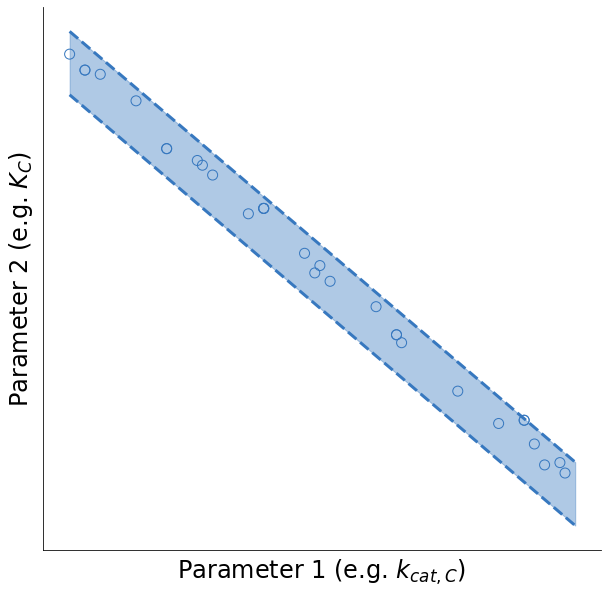 | 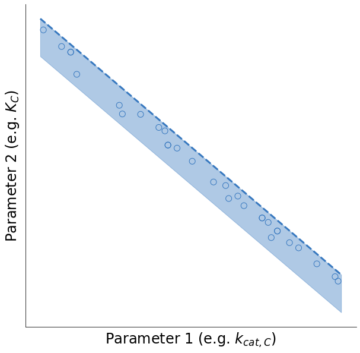 |

#### [Figure 3: Dataset Summary](notebooks/Figure3%20Dataset%20Summary.ipynb)
- **Scientific Context:** Establishes the scale and taxonomic scope of the extended dataset compared to earlier literature.
- **Key Findings:**
  - Aggregates measurements from **61 published studies**, covering **380 wild-type Rubiscos** from **304 distinct species** (208 entries with complete $\{k_{\text{cat},C}, K_C, K_O, S_{C/O}\}$ sets).
  - Captures Rubisco structural forms: Form I ($\text{L}_8\text{S}_8$, hexadecameric; found in plants, algae, cyanobacteria), Form II ($\text{L}_2\text{--}\text{L}_n$, dimeric/oligomeric; found in dinoflagellates and purple non-sulfur bacteria), and Form III.
  - Spans diverse host physiological groups: C3 plants, C4 plants, CAM plants, red algae, green algae, diatoms, cyanobacteria, and proteobacteria.
  - Displays dynamic parameter ranges: $S_{C/O}$ ranges from $\approx 9$ (Form II) to $>160$ (red algae); $k_{\text{cat},C}$ ranges from $<1\text{ s}^{-1}$ to $>11\text{ s}^{-1}$.

| Taxonomic Distribution of Measurements | Rubisco Structural Isoform Counts |
|:---:|:---:|
| 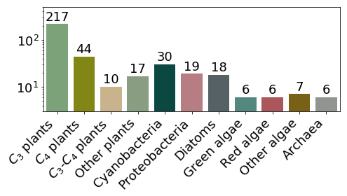 | 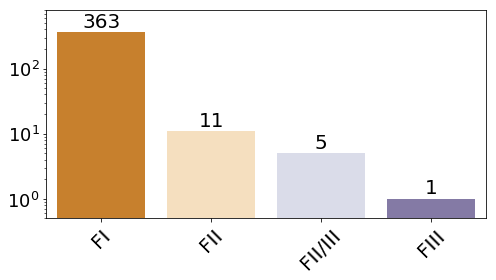 |

<p align="center">
  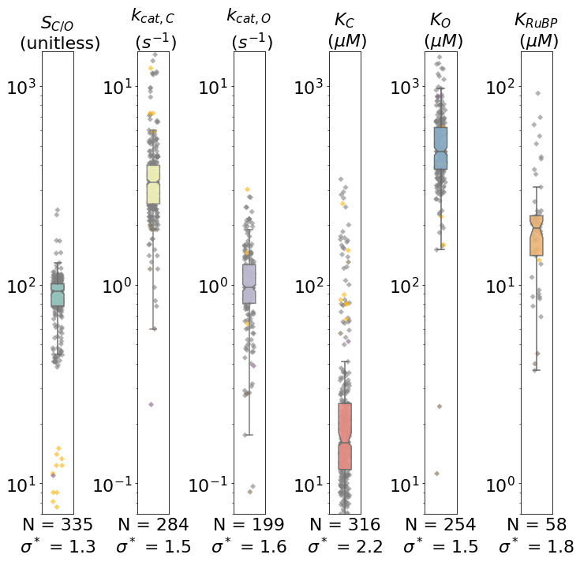<br/>
  <em>Distributions and dynamic ranges of all primary kinetic parameters across the dataset.</em>
</p>

#### [Figure 4: Correlation Heatmap](notebooks/Figure4%20Correlation%20Heatmap.ipynb)
- **Scientific Context:** Systematic pairwise evaluation of all log-scale and linear correlations across Form I Rubiscos.
- **Key Findings:**
  - Evaluates correlations across $\{\ln S_{C/O}, \ln k_{\text{cat},C}, \ln K_C, \ln K_O, \ln k_{\text{cat},O}, \ln(k_{\text{cat},C}/K_C), \ln(k_{\text{cat},O}/K_O)\}$.
  - Reveals widespread attenuation: almost all pairwise correlations previously thought to be near-deterministic are moderate or weak ($|R| \approx 0.4\text{--}0.6$).
  - Notable moderate correlations: $S_{C/O}$ vs $K_C$ ($R = -0.66$), $S_{C/O}$ vs $k_{\text{cat},C}$ ($R = -0.56$), $K_C$ vs $K_O$ ($R = 0.56$).

| All Parameters Correlation Heatmap | Directly Measured Parameters Heatmap |
|:---:|:---:|
| 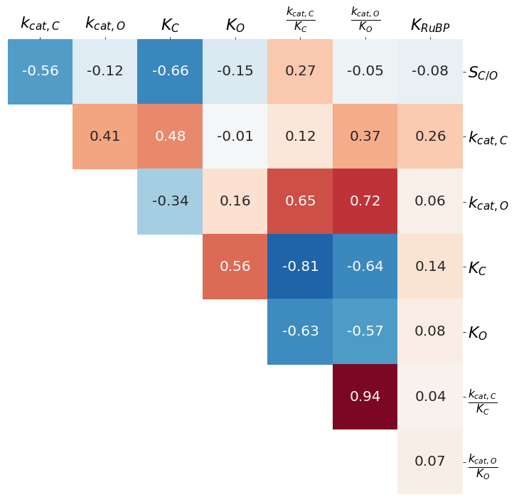 | 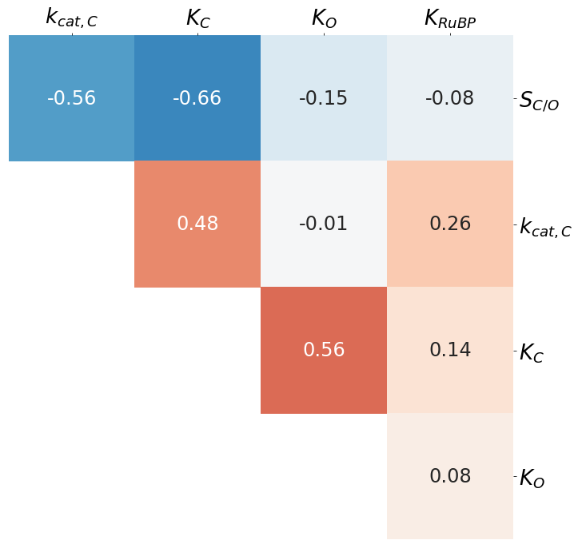 |

#### [Figure 5: Re-Evaluating Previous $k_{\text{cat},C}$ Correlations](notebooks/Figure5%20Previous%20kcatC%20Correlations.ipynb)
- **Scientific Context:** Re-tests the two cornerstone trade-offs asserted by *Savir et al. (2010)* using the expanded dataset.
- **Analysis & Findings:**
  - **$k_{\text{cat},C}$ vs $S_{C/O}$ (Panel A):** In the Savir dataset ($N \approx 18$), log-linear $R = -0.71$. Across the expanded Form I dataset ($N > 200$), the correlation attenuates to $R = -0.56$ (Spearman rank $R = -0.38$, and $R = 0.03$ globally across all forms). Bootstrapping reveals wide 95% confidence intervals on the power-law exponent ($-3.97$ to $-1.99$), demonstrating that the trade-off is not a rigid physical limit.
  - **$k_{\text{cat},C}$ vs $K_C$ (Panel B):** In the Savir dataset, $R = 0.92$. In the expanded Form I dataset, the correlation drops to $R = 0.48$ ($P = 3.4 \times 10^{-15}$). High catalytic rate does not rigidly necessitate low substrate affinity.

| Panel A: $k_{\text{cat},C}$ vs $S_{C/O}$ Correlation | Panel B: $k_{\text{cat},C}$ vs $K_C$ Correlation |
|:---:|:---:|
| 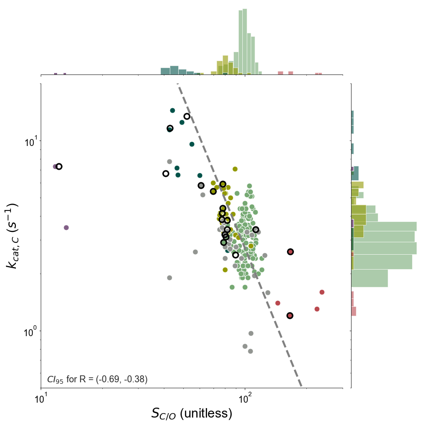 | 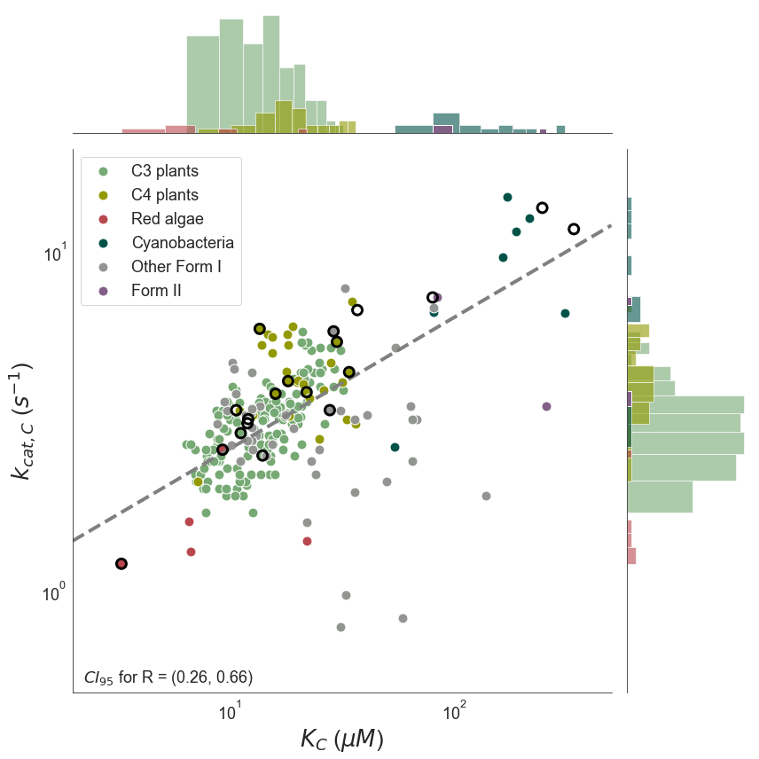 |

#### [Figure 6: Mechanistic Proposal #1](notebooks/Figure6%20Mechanistic%20Proposal%20%231.ipynb)
- **Hypothesis:** Under Proposal #1 (formulated from transition-state theory by *Tcherkez et al. 2006*), tighter binding of the carboxylation transition state accelerates maximal turnover rate ($k_{\text{cat},C}$), predicting a direct coupling between $k_{\text{cat},C}/K_C$ and $k_{\text{cat},C}$.
- **Empirical Test:**
  - In the small Savir subset, an apparent inverse correlation was observed ($R = -0.72$).
  - In the expanded Form I dataset, the correlation is **statistically non-significant** ($R = 0.12, P = 0.054$; Spearman rank $R = 0.10, P = 0.11$).
  - Within C3 plants alone, $R = 0.01$ ($P = 0.895$).
- **Conclusion:** Mechanistic Proposal #1 is thoroughly rejected by the broader empirical record.

<p align="center">
  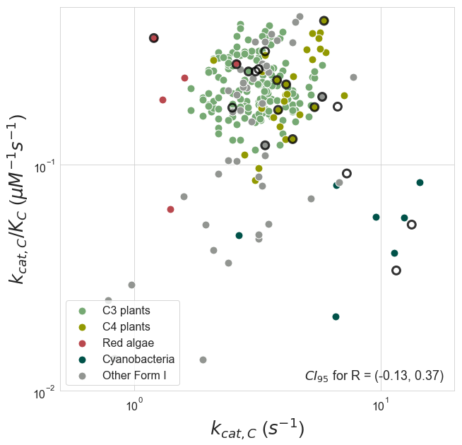<br/>
  <em>Evaluation of Proposal #1 across physiological lineages showing lack of significant correlation.</em>
</p>

#### [Figure 7: Mechanistic Proposal #2](notebooks/Figure7%20Mechanistic%20Proposal%20%232.ipynb)
- **Hypothesis:** Under Proposal #2, discrimination between $\text{CO}_2$ and $\text{O}_2$ is constrained by the geometry and electrostatic similarity of their respective addition transition states. This predicts that increasing catalytic efficiency for carboxylation ($k_{\text{cat},C}/K_C$) unavoidably increases catalytic efficiency for oxygenation ($k_{\text{cat},O}/K_O$) via a power law:
  $$\frac{k_{\text{cat},C}}{K_C} = a \left(\frac{k_{\text{cat},O}}{K_O}\right)^b$$
- **Empirical Test & Findings:**
  - Form I Rubiscos display an **extremely strong power-law correlation** ($R = 0.94, P = 6 \times 10^{-87}$).
  - Orthogonal Distance Regression yields an exponent indistinguishable from unity: $b = 1.04$ (95% CI: 0.93–1.12), with prefactor $a = 118.9$ (95% CI: 63–200).
  - Forcing the exponent to $b = 1.0$ (using the geometric mean $S_{C/O} \approx 90$ as prefactor) explains $80.4\%$ of the total variance across all Form I Rubiscos.
  - Sub-lineage fits show remarkable consistency: C3 plants ($R^2 = 0.84$), C4 plants ($R^2 = 0.96$), cyanobacteria ($R^2 = 0.79$).
- **Conclusion:** Proposal #2 is strongly supported, proving that the dominant trade-off in Rubisco is the simultaneous facilitation of both carboxylation and oxygenation catalytic efficiencies.

| Catalytic Efficiency Power Law by Host Group | Specificity Factor ($S_{C/O}$) Distributions |
|:---:|:---:|
| 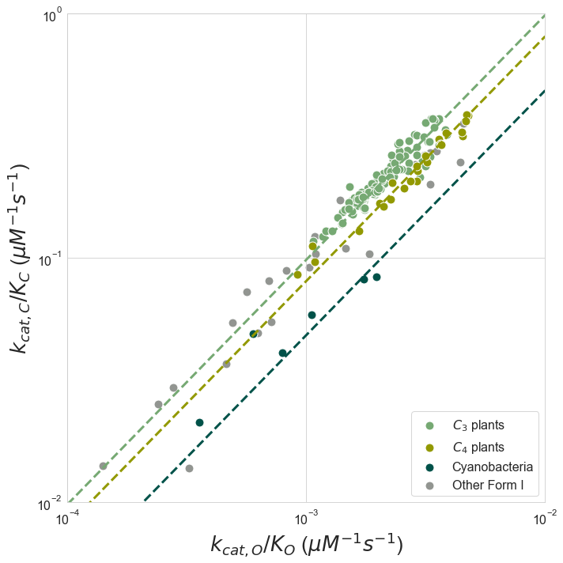 | 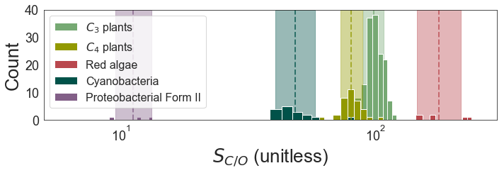 |

#### [Figure 8: Reactive State Model](notebooks/Figure8%20Reactive%20State%20Model.ipynb)
- **Scientific Context:** Evaluates how specificity ($S_{C/O}$) behaves within and between distinct phylogenetic and physiological lineages.
- **Key Findings:**
  - Within distinct physiological groups, specificity is tightly conserved (very low multiplicative variability: C3 plants $\sigma^* = 0.04$, C4 plants $\sigma^* = 0.05$, red algae $\sigma^* = 0.09$).
  - Between physiological groups, specificity exhibits discrete, statistically significant shifts (confirmed by Welch's $t$-tests; e.g., C3 vs C4 plants $T = 11.67, P = 2.2 \times 10^{-16}$; C3 plants vs cyanobacteria $T = 18.29, P = 9.8 \times 10^{-13}$).
  - These shifts mirror evolutionary environmental pressures: organisms lacking $\text{CO}_2$-concentrating mechanisms (CCMs) like C3 plants and red algae evolved high $S_{C/O}$, whereas organisms with efficient CCMs (C4 plants, cyanobacteria) relaxed specificity selection in favor of higher turnover rate.

| Specificity vs Carboxylation Efficiency | Reactive State Group Clustering |
|:---:|:---:|
| 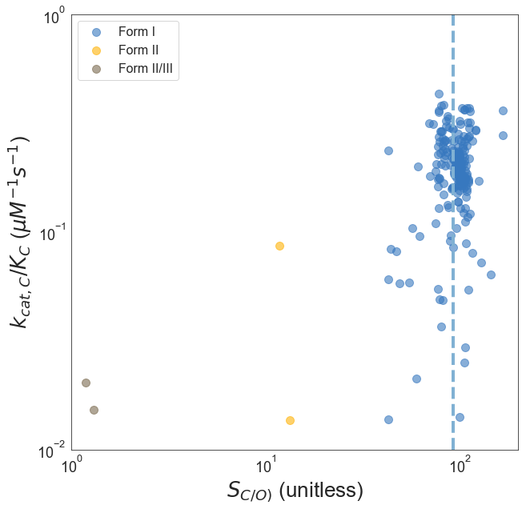 | 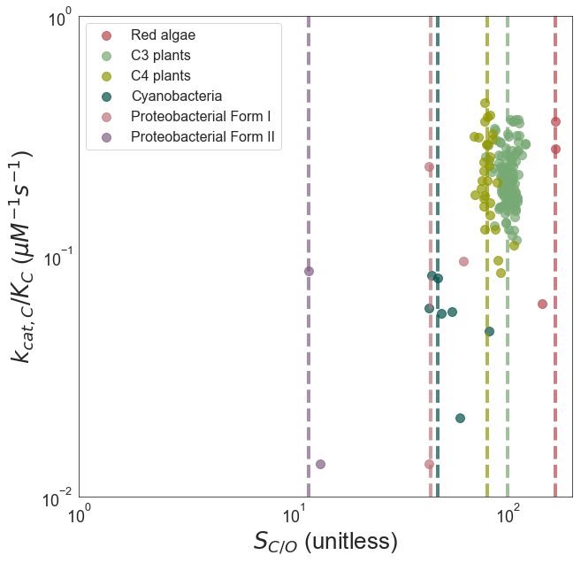 |

---

### Supplementary Figures

| Notebook | Focus & Scientific Takeaway | Key Figure Preview |
|:---|:---|:---:|
| [Figure S3 Error Analysis](notebooks/FigureS3%20Error%20Analysis.ipynb) | Analyzes experimental standard deviations vs measured means. Confirms that measurement errors scale multiplicatively with the value (roughly constant CV), validating log-transformed regression and ODR. | 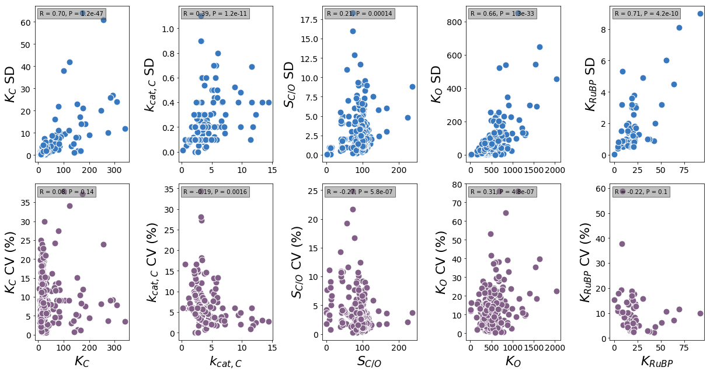 |
| [Figure S4 Kinetic Parameter Histograms](notebooks/FigureS4%20Kinetic%20Parameter%20Histograms.ipynb) | Histograms and density curves of all kinetic parameters ($S_{C/O}, k_{\text{cat},C}, K_C, K_O, k_{\text{cat},O}$) for Form I vs all forms, reporting geometric means and central 95% ranges. | 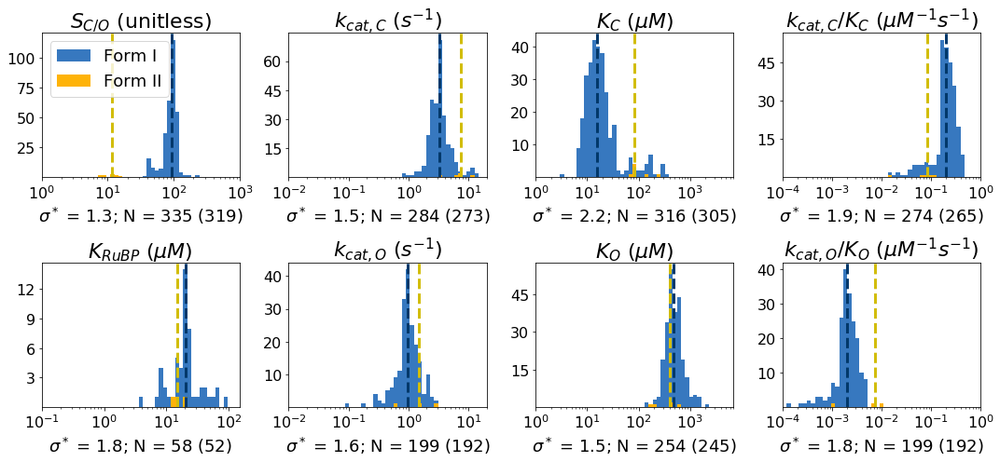 |
| [Figure S5 kcat variability](notebooks/Figure%20S5%20kcat%20variability.ipynb) | Compares Rubisco $k_{\text{cat},C}$ variability ($\sigma^* \approx 1.9$) against 25 enzymes from the BRENDA database with $>20$ measurements (median enzyme $\sigma^* \approx 6.9$). Shows Rubisco turnover variability is typical of metabolic enzymes, not unnaturally constrained. | 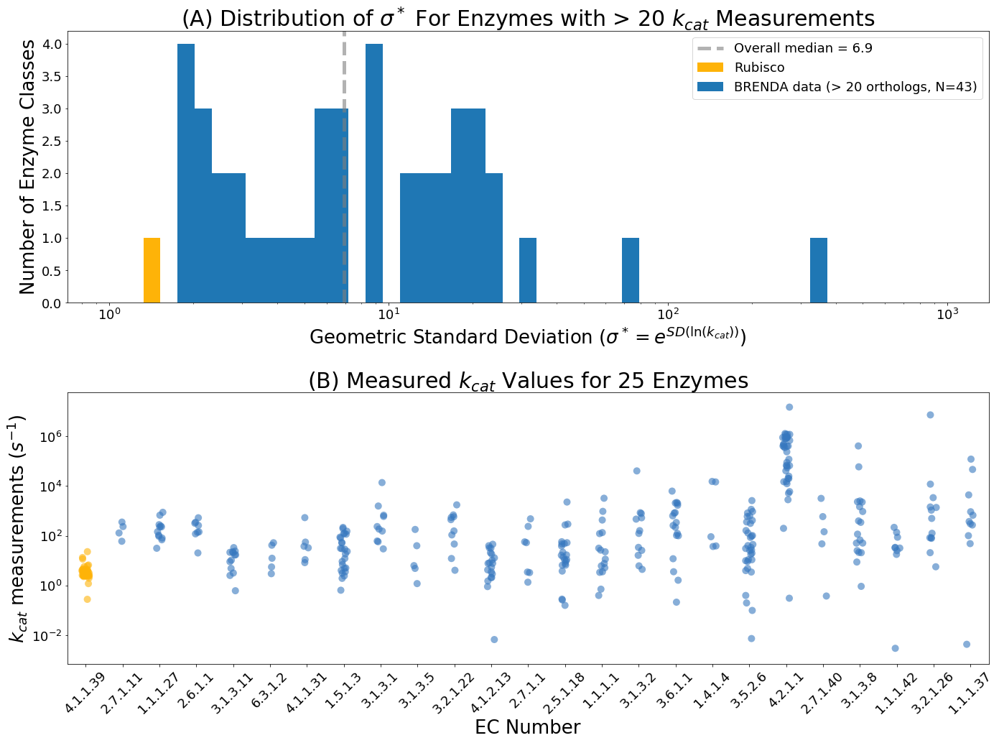 |
| [Figure S6 Rubisco Kinetics by Host Type](notebooks/FigureS6%20Rubisco%20Kinetics%20by%20Host%20Type.ipynb) | Large multi-panel pairwise scatterplots mapping kinetic parameters across individual host groups: C3 plants, C4 plants, CAM plants, red algae, green algae, cyanobacteria, and proteobacteria. | 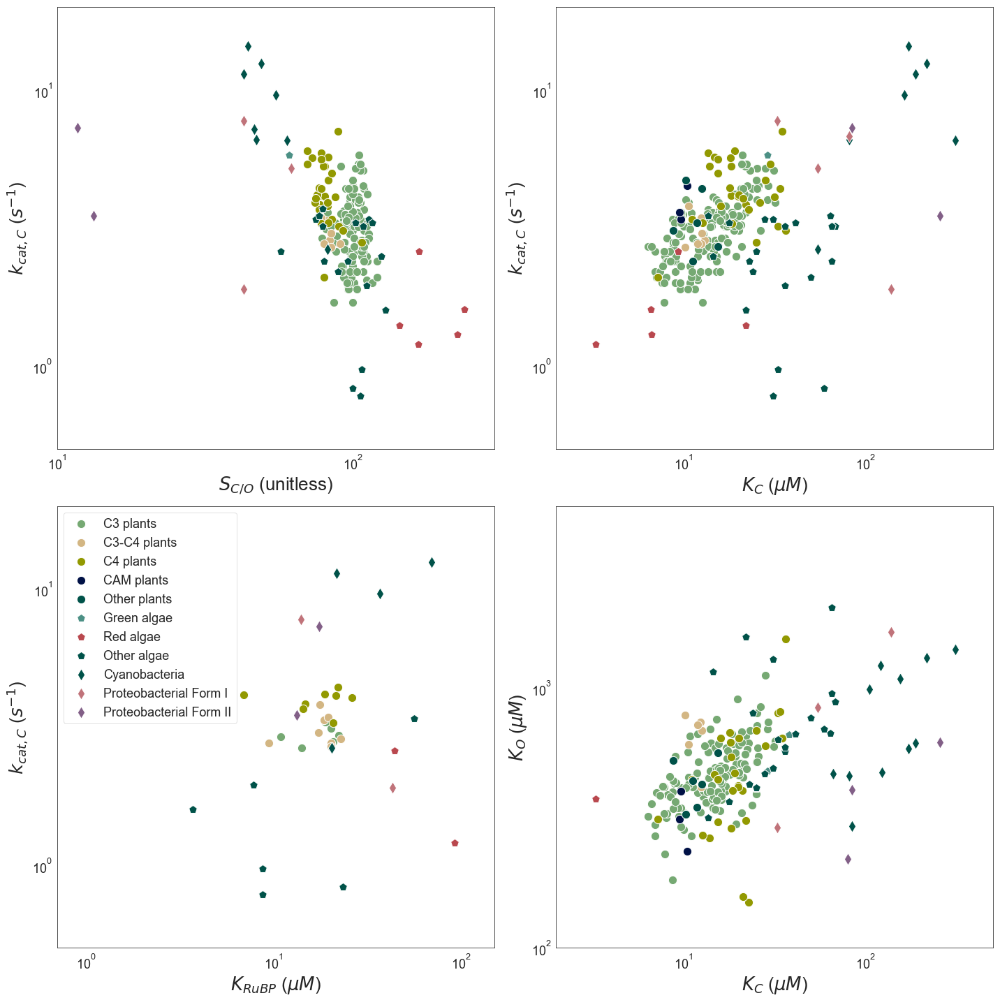 |
| [Figure S7 linear correlations](notebooks/FigureS7%20linear%20correlations.ipynb) | Evaluates Pearson and Spearman correlations in linear scale, contrasting them with log-scale results to demonstrate how log transformation prevents high-value outliers from dominating fits. | 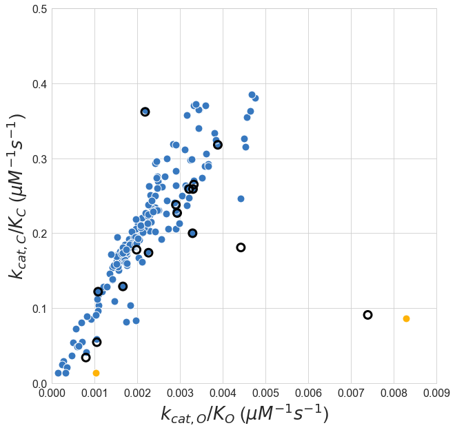 |
| [Figure S8 PCA](notebooks/Figure%20S8%20PCA.ipynb) | Performs Principal Component Analysis (PCA) on standardized kinetic coordinates. Demonstrates that while the original Savir dataset collapsed into 1 dimension (PC1 explained 91.0% of variance), the expanded dataset is multi-dimensional (PC1 explains 71.3% in Form I, 61.6% in full dataset), rejecting the 1D Pareto hypothesis. | 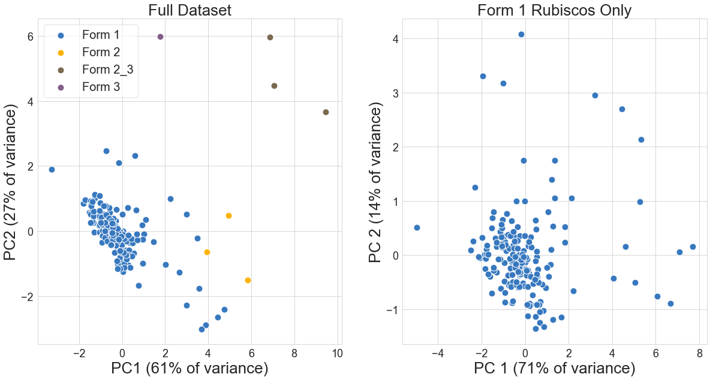 |
| [Figure S9 Residual Analysis](notebooks/FigureS9%20Residual%20Analysis.ipynb) | Computes orthogonal residuals from Total Least Squares regressions, analyzing covariance matrices, variance explained, and identifying kinetic outlier species (e.g. *Flaveria pringlei*, *Zea mays*). | 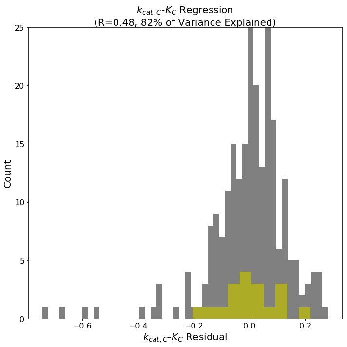 |
| [Figure S10 kcatO correlations](notebooks/FigureS10%20kcatO%20correlations.ipynb) | Detailed analysis of correlations involving oxygenation turnover ($k_{\text{cat},O}$) and affinity ($K_O$). | 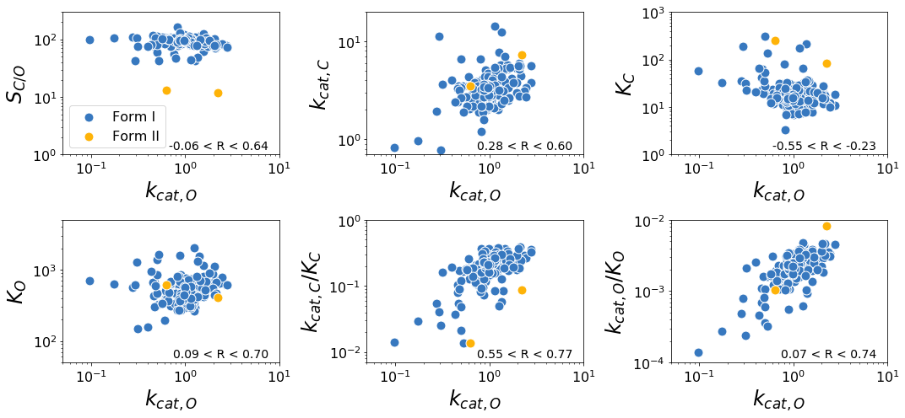 |
| [Figure S11 Mutant Kinetics](notebooks/FigureS11%20Mutant%20Kinetics.ipynb) | Maps laboratory-engineered Rubisco mutants (e.g., *Synechococcus elongatus* PCC 7942, *Rhodospirillum rubrum*) against wild-type distributions, illustrating how mutational walks traverse the catalytic landscape. | 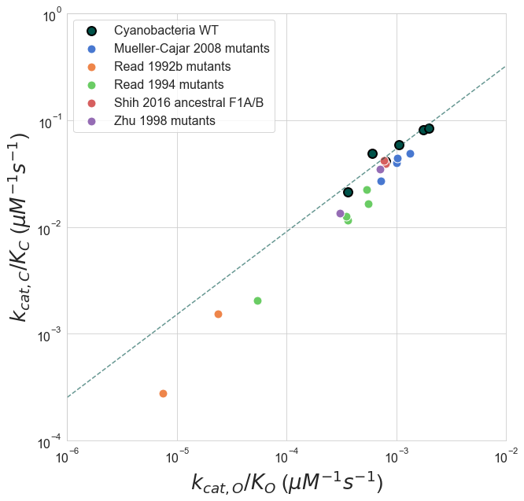 |

---

### Data Cleaning & Validation Notebooks

- **[Normalize and Merge Raw Data.ipynb](notebooks/Normalize%20and%20Merge%20Raw%20Data.ipynb):**
  1. Filters out uncomparable measurements (non-25 °C temperatures, pH outside physiological ranges, dubious entries).
  2. Imputes unmeasured standard deviations using average coefficients of variation ($\text{CV}$).
  3. Parametrically bootstraps inferred values for $k_{\text{cat},O}$, $k_{\text{on},C}$, and $k_{\text{on},O}$ with 95% confidence intervals.
  4. Merges repeated measurements from identical references and species into `DatasetS2_RubiscoKinetics_Merged.csv`.
- **[Dataset Sanity Checks.ipynb](notebooks/Dataset%20Sanity%20Checks.ipynb):**
  - Audits duplicate measurements between the Savir 2010 dataset and primary sources.
  - Verifies measurement consistency across landmark species (e.g., spinach *Spinacia oleracea*, tobacco *Nicotiana tabacum*, maize *Zea mays*).
- **[Bootstrapping Sanity Checks.ipynb](notebooks/Bootstrapping%20Sanity%20Checks.ipynb):**
  - Compares bootstrap-inferred $k_{\text{cat},O}$ values against the rare literature-reported direct measurements ($R \approx 1.0$), identifying and quantifying minor discrepancies.

---

## Datasets Overview

Located in the [`data/`](data/) directory:

| Filename | Records | Description |
|:---|:---:|:---|
| [`DatasetS1_SourceRubiscoKinetics.csv`](data/DatasetS1_SourceRubiscoKinetics.csv) | 380 | Master table of kinetic measurements extracted from 61 published papers, including full citations, DOI/PMIDs, experimental temperature, pH, and notes. |
| [`DatasetS1_RubiscoKinetics.xlsx`](data/DatasetS1_RubiscoKinetics.xlsx) | 380 | Excel workbook version of Dataset S1 with formatted sheets and metadata. |
| [`DatasetS2_RubiscoKinetics_Merged.csv`](data/DatasetS2_RubiscoKinetics_Merged.csv) | 260 | Curated and normalized dataset (WT only, 25 °C), deduplicated, with bootstrap-inferred parameters and 95% confidence intervals (`vO`, `kon_C`, `kon_O`). Primary file for downstream analysis. |
| [`DatasetS3_BRENDA_Kinetics.csv`](data/DatasetS3_BRENDA_Kinetics.csv) | ~1,000s | Multi-enzyme $k_{\text{cat}}$ dataset extracted from the BRENDA database to evaluate enzyme catalytic rate variability ($\sigma^*$). |
| [`DatasetS4_RubiscoKineticsFull_Merged.csv`](data/DatasetS4_RubiscoKineticsFull_Merged.csv) | 348 | Merged dataset containing both wild-type and mutant Rubiscos, used in Figure S11. |
| [`AF_KIE_analysis.xlsx`](data/AF_KIE_analysis.xlsx) | — | Calculations and literature compilation for Rubisco Carbon Kinetic Isotope Effects ($^{12}\text{C}/^{13}\text{C}$ KIEs). |

---

## Core Code Modules

Located in the [`notebooks/`](notebooks/) directory:

- **[`rubisco_data.py`](notebooks/rubisco_data.py):**
  - `load_rubisco_data()`: Reads `DatasetS2_RubiscoKinetics_Merged.csv` and returns `raw_df` and `kin_df` (filtered for complete $\{K_C, K_O, v_C, v_O, k_{\text{on},C}, k_{\text{on},O}\}$ availability).
  - `filter_data(raw_kin_df)`: Isolates and flags duplicate entries between secondary compilations and primary studies.
  - `merge_organisms(kin_df)`: Aggregates measurements by species and isoform using a median filter.
- **[`power_laws.py`](notebooks/power_laws.py):**
  - `fit_power_law_odr(log_xs, log_ys, unit_exp=False)`: Fits power laws $y = a x^b$ using Orthogonal Distance Regression (scipy.odr) on log-transformed variables.
  - `bootstrap_power_law_odr(xs, ys, fraction=0.9, rounds=1000)`: Bootstraps 95% confidence intervals for exponents, prefactors, and Pearson $R$.
  - `sigma_star(vals)`: Calculates multiplicative standard deviation $\sigma^* = \exp(\text{std}(\ln x))$.
  - `plot_bootstrapped_range(exponents, prefactors)`: Generates dual-panel histograms of bootstrapped parameter estimates.
- **[`stats_utils.py`](notebooks/stats_utils.py):**
  - `RubiscoKinetics`: Class encapsulating kinetic values and standard deviations, implementing Monte Carlo / bootstrapping inference for $k_{\text{cat},O}$, $k_{\text{on},C}$, and $k_{\text{on},O}$.
  - `combine_dists(means, stds, n=1000)`: Merges distinct experimental measurements into combined Gaussian distributions via equal-weighted bootstrapping.

---

## Requirements & Setup

### Environment
The analysis is written in Python (compatible with Python 3.6+).

Key dependencies:
```bash
pip install numpy scipy pandas matplotlib seaborn scikit-learn jupyter
```

### Running the Notebooks
To explore any figure or analysis:
```bash
cd notebooks/
jupyter notebook
```
Open any of the notebooks (e.g. `Figure7 Mechanistic Proposal #2.ipynb`) and run all cells to reproduce the statistical regressions and figures.

---

## Citation

If you use this dataset, analysis, or code in your research, please cite:

```bibtex
@article{Flamholz2019Rubisco,
  author = {Flamholz, Avi I. and Prywes, Noam and Moran, Uri and Davidi, Dan and Bar-On, Yinon M. and Oltrogge, Luke M. and Milo, Ron and Savage, David F.},
  title = {Revisiting Trade-offs between Rubisco Kinetic Parameters},
  journal = {Biochemistry},
  volume = {58},
  number = {33},
  pages = {3365--3376},
  year = {2019},
  doi = {10.1021/acs.biochem.9b00237}
}
```